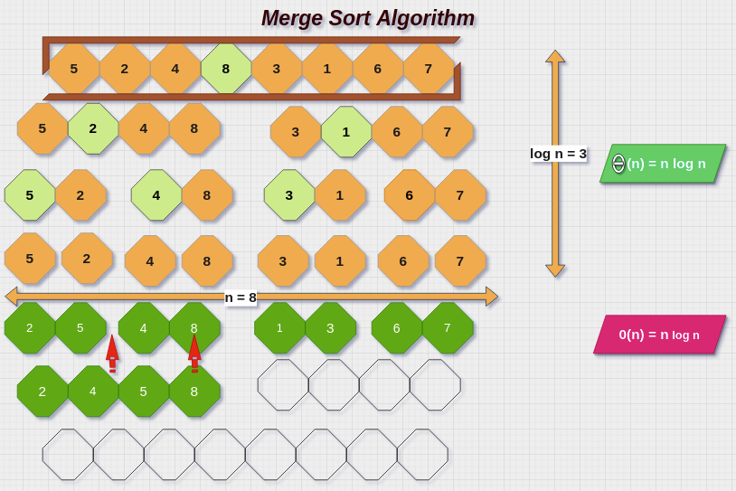
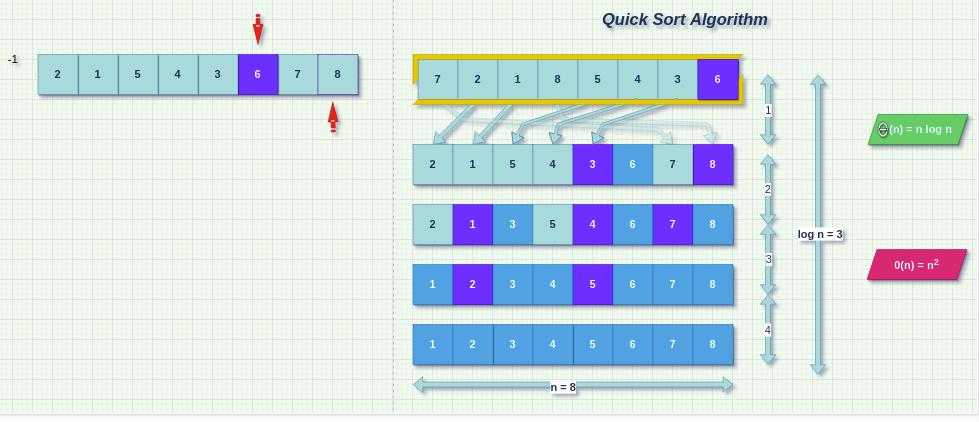

# Workshop - Two Efficient Sorts Samples - Java Variant

###### This is part of Codecool's Biweekly OOP & Advanced Topics conferences.

---
1. ## [Merge Sort Algorithm](#Merge-Sort-Algorithm)
2. ## [Quick Sort Algorithm](#Quick-Sort-Algorithm)
---
- You can also find here 3 samples of simple sorts (_Insertion Sort_, _Selection Sort_ and _Bubble Sort_).
- For the C# version of the workshop, go to [Csharp Sorts](https://github.com/TudorDan/Workshop-Csharp-TwoEfficientSorts#Merge-Sort-Algorithm).

# Merge Sort Algorithm

---

# Quick Sort Algorithm
